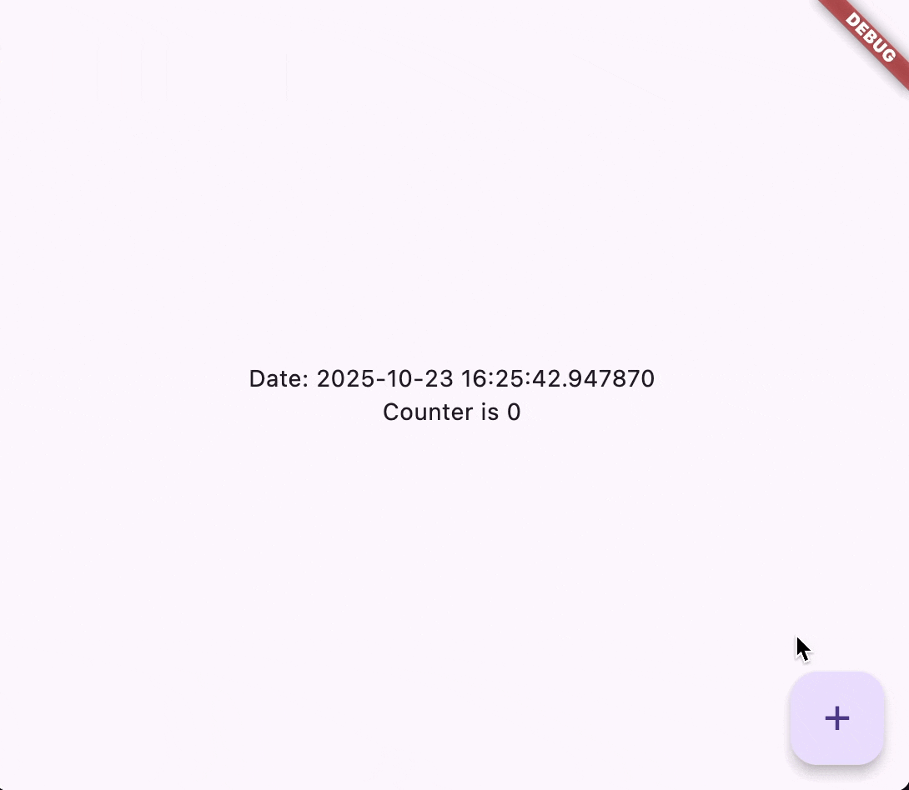

Solid is a tiny framework built on top of Flutter that makes building apps easier and more enjoyable.
The benefits of using Solid include:
1. **Don't write boilerplate**: Solid generates boilerplate code for you, so you can focus on building your app. Inspired by SwiftUI.
2. **No state management/dependency injection manual work**: Solid has built-in state management and dependency injection. Just annotate your variables and Solid takes care of the rest.
3. **Fine-grained reactivity**: Solid's reactivity system is inspired by SolidJS, allowing for efficient and fine-grained updates to your UI. Only the parts of the UI that depend on changed state are updated, leading to better performance. And the best is that you don't have to think about it, Solid does it for you automatically.

## Example

You write this code, without any boilerplate and manual state management:

```dart
import 'package:flutter/material.dart';
import 'package:solid_annotations/solid_annotations.dart';

class Counter extends StatelessWidget {
  Counter({super.key});

  @SolidState()
  int counter = 0;

  @override
  Widget build(BuildContext context) {
    return Scaffold(
      body: Center(
        child: Column(
          mainAxisSize: MainAxisSize.min,
          children: [
            Text('Date: ${DateTime.now()}'),
            Text('Counter is $counter'),
          ],
        ),
      ),
      floatingActionButton: FloatingActionButton(
        onPressed: () => counter++,
        child: const Icon(Icons.add),
      ),
    );
  }
}
```

You get this result, with real fine-grained reactivity:
[](../../assets/solid_demo.gif)

As you can see, the `DateTime.now()` text does not update when the counter changes, only the `Counter is X` text updates. This is because Solid tracks which parts of the UI depend on which state, and only updates those parts when the state changes, without any manual work from you.

If this sounds interesting, check out the [getting started guide](/guides/getting-started) to learn how to set up Solid in your Flutter project!
